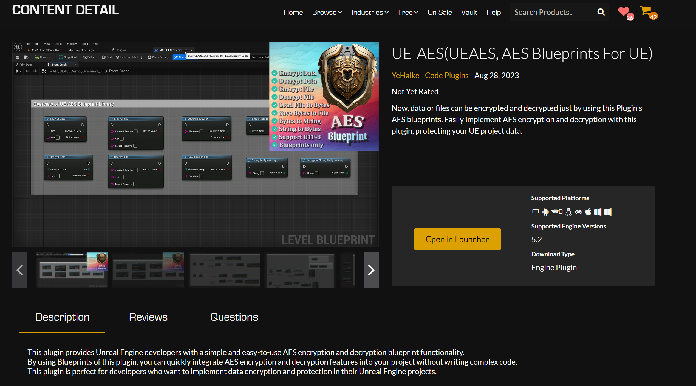
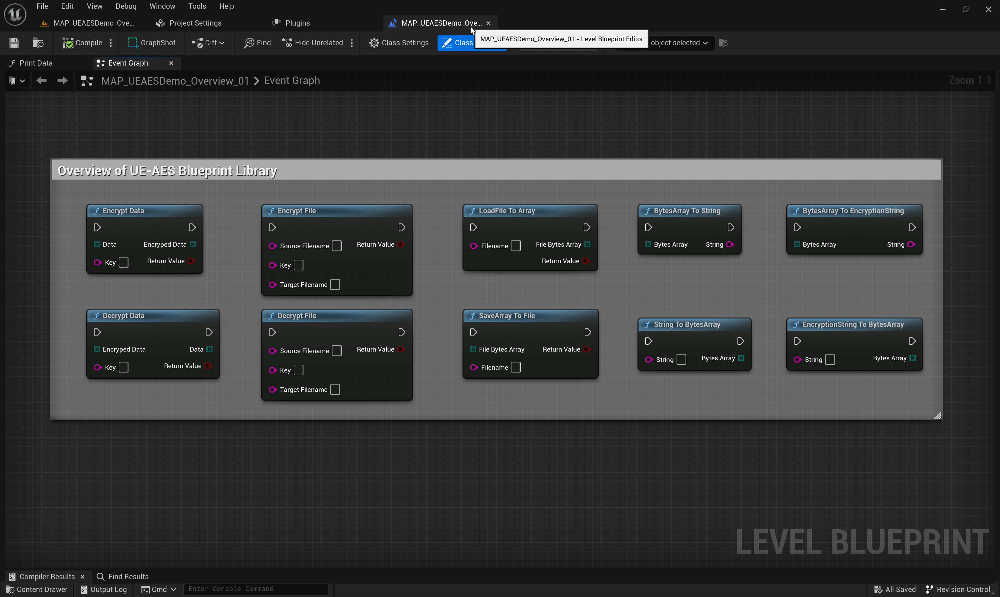
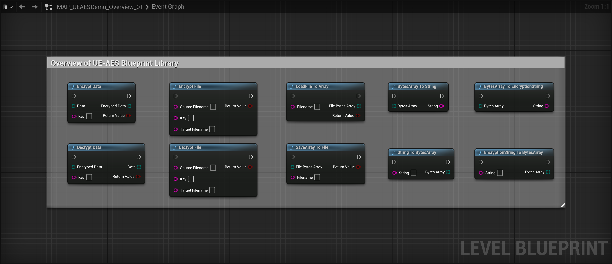
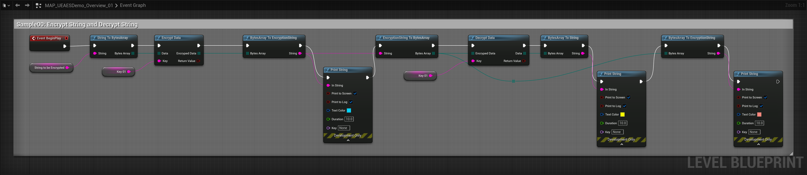
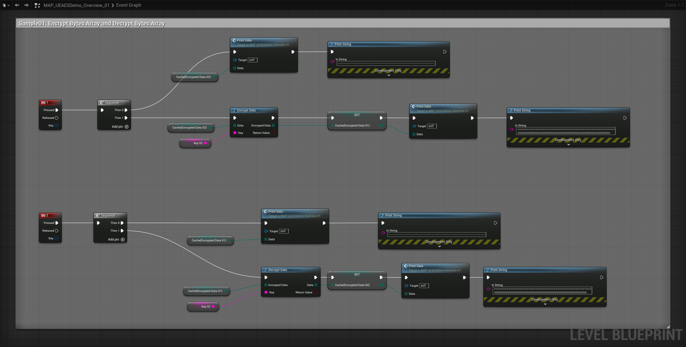
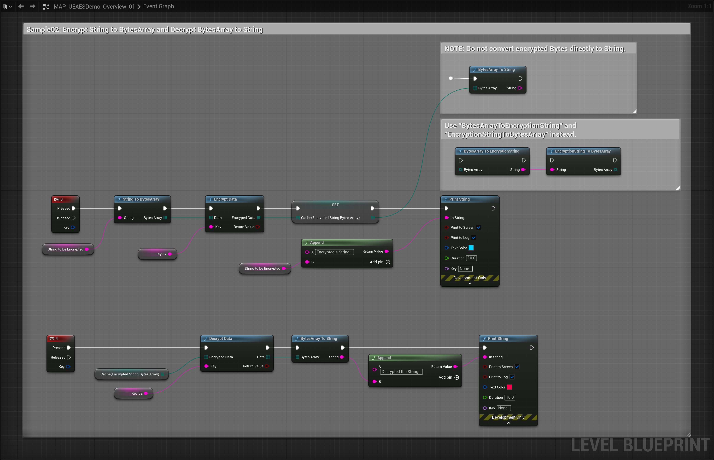
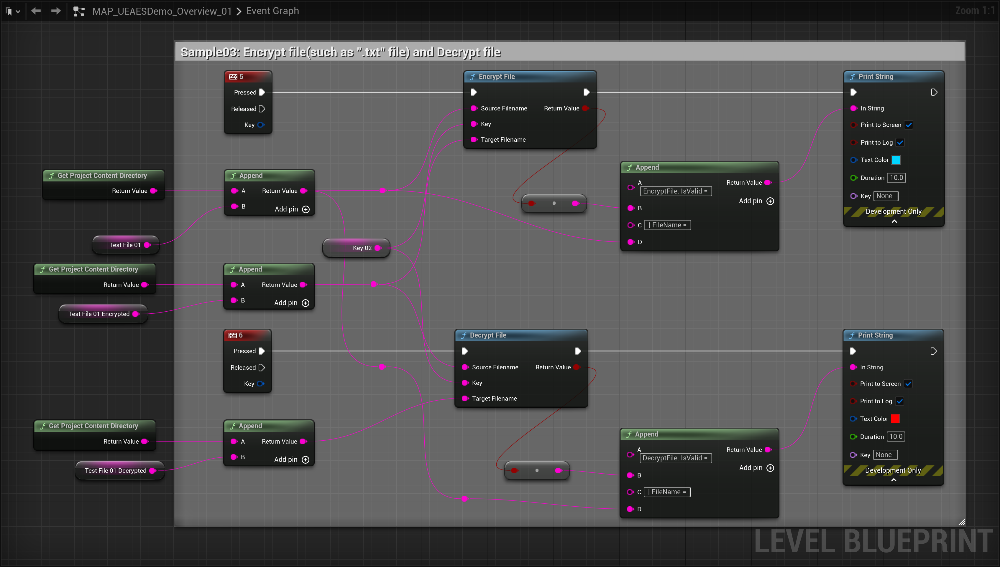
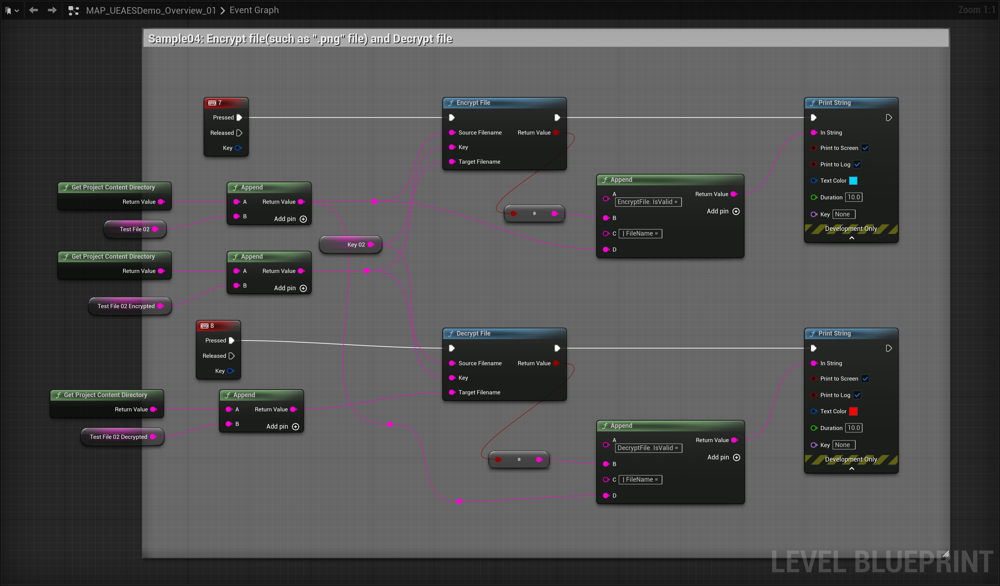
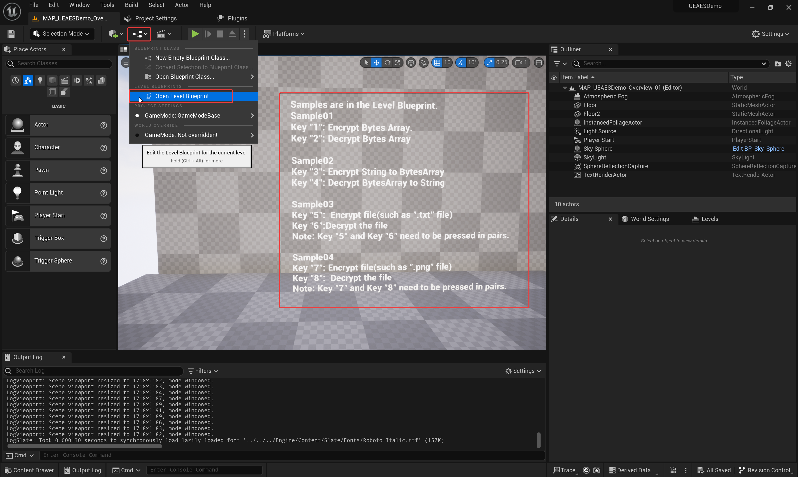
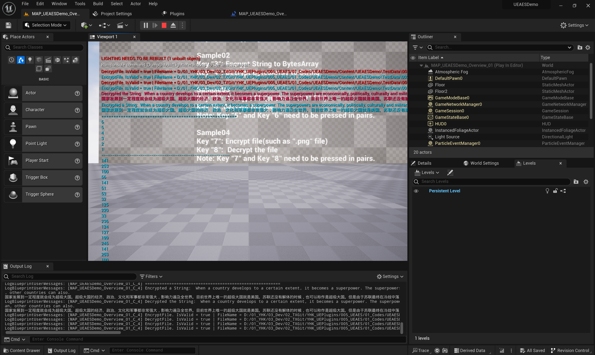

**Note:** There is a bug with the github DownloadZIP(".map" asset file are Git LFS file, Github DownloadZIP results in the ".map" file only 1KB).  **You should clone this repository by HTTPs of this git, Not by Github DownloadZIP.**

# PRODUCT TITLE：

**UE-AES(UEAES, AES Blueprints For UE)**

**UE Marketplace:** https://www.unrealengine.com/marketplace/zh-CN/product/ue-aes-ueaes-aes-blueprints-for-ue

# SHORT DESCRIPTION：

Now, data or files can be encrypted and decrypted just by using this Plugin's AES blueprints. Easily implement AES encryption and decryption with this plugin, protecting your UE project data.

# LONG DESCRIPTION：

This plugin provides Unreal Engine developers with a simple and easy-to-use AES encryption and decryption blueprint functionality. By using Blueprints of this plugin, you can quickly integrate AES encryption and decryption features into your project without writing complex code. This plugin is perfect for developers who want to implement data encryption and protection in their Unreal Engine projects.

## Features: 

- Encrypt Decrypt Data(Bytes or Strings)
- Encrypt Decrypt File(Any files)
- Load File to Bytes, Save Bytes to File
- Bytes to String, String to Bytes
- Support UTF-8
- Blueprints only needed: No programming knowledge required, simply use Blueprints to implement AES encryption and decryption
- Supports all target platforms

# Blueprint nodes overview of "UE-AES"

**Level Blueprint Of This Map**:`'./UEAESDemo/Map/MAP_UEAESDemo_Overview_01'`

## Detailed description of each node

### UE-AES Blueprint Library Nodes:

# Example Introduction

